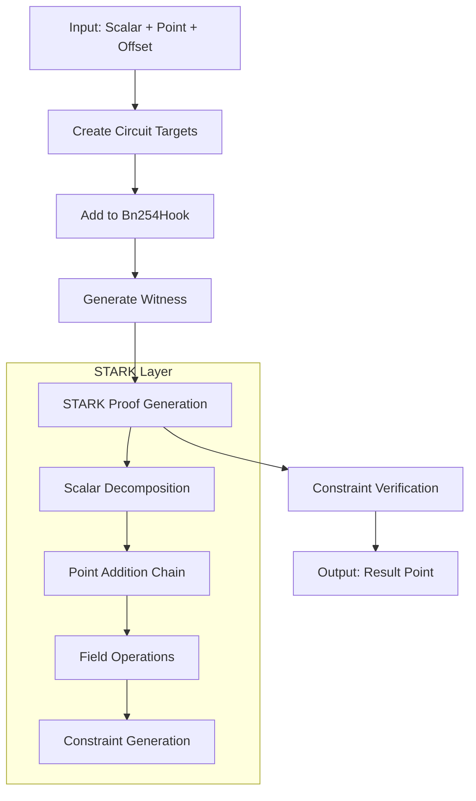
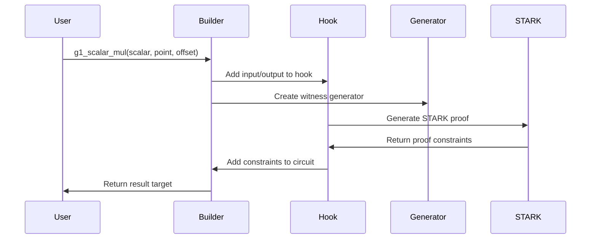

# plonky2_bn254


STARK-based BN254 elliptic curve operations for Plonky2.

## Overview

This library extends Plonky2 with STARK implementations for BN254 elliptic curve operations. It focuses on scalar multiplication for G1 and G2 groups, field exponentiation, and related cryptographic primitives.

## Features

- G1 and G2 scalar multiplication with STARK proofs
- Field arithmetic for Fq and Fq2
- Hash-to-curve functionality for G2
- Integration with Plonky2 circuit builders

## Architecture

### Structure

The library is organized into several modules:

- `curves/` - G1 and G2 point operations
- `fields/` - Fq and Fq2 field arithmetic
- `starks/` - STARK implementations for curve and field operations
- `generators/` - Witness generators for STARK proofs
- `utils/` - Hash-to-curve and multi-scalar multiplication
- `builder.rs` - Plonky2 circuit builder extensions
- `hook.rs` - Integration hooks for STARK proofs

### Core Data Structures

#### G1Target

Represents a point on the G1 elliptic curve in circuit form:

```rust
pub struct G1Target<F: RichField + Extendable<D>, const D: usize> {
    pub x: FqTarget<F, D>,  // x-coordinate in base field
    pub y: FqTarget<F, D>,  // y-coordinate in base field
}
```

#### G2Target

Represents a point on the G2 elliptic curve in circuit form:

```rust
pub struct G2Target<F: RichField + Extendable<D>, const D: usize> {
    pub x: Fq2Target<F, D>, // x-coordinate in extension field
    pub y: Fq2Target<F, D>, // y-coordinate in extension field
}
```

#### FqTarget

Represents an element in the base field Fq:

```rust
pub struct FqTarget<F: RichField + Extendable<D>, const D: usize> {
    value: BigUintTarget,     // Big integer representation
    mod_taken: bool,          // Whether modulus has been applied
    _maker: PhantomData<F>,   // Type marker
}
```

#### U256

Internal representation for 256-bit values:

```rust
pub struct U256<T> {
    pub value: [T; N_LIMBS], // 16 limbs of 16 bits each
}
```

Note: FqTarget uses 8 limbs of 32 bits each for field element representation.

## Processing Flow

### 1. Scalar Multiplication Workflow



### 2. Circuit Building Process



## Usage Examples

### G1 Scalar Multiplication

```rust
use plonky2::plonk::{circuit_builder::CircuitBuilder, circuit_data::CircuitConfig};
use plonky2_bn254::{
    builder::BuilderBn254Stark,
    curves::g1::G1Target,
    fields::biguint::CircuitBuilderBiguint,
};

let mut builder = CircuitBuilder::<F, D>::new(CircuitConfig::default());

// Create inputs
let scalar = builder.add_virtual_biguint_target(8);
let point = G1Target::new_checked(&mut builder);
let offset = G1Target::new_checked(&mut builder);

// Perform scalar multiplication: result = scalar * point + offset
let result = builder.g1_scalar_mul::<C>(scalar, point, offset);
```

### G2 Scalar Multiplication

```rust
use plonky2_bn254::{curves::g2::G2Target, fields::fq::FqTarget};

let mut builder = CircuitBuilder::<F, D>::new(CircuitConfig::default());

// Create inputs
let scalar = builder.add_virtual_biguint_target(8);
let point = G2Target::new_checked(&mut builder);
let offset = G2Target::new_checked(&mut builder);

// Perform scalar multiplication
let result = builder.g2_scalar_mul::<C>(scalar, point, offset);
```

### Field Exponentiation

```rust
use plonky2_bn254::fields::fq::FqTarget;

let mut builder = CircuitBuilder::<F, D>::new(CircuitConfig::default());

// Create inputs
let base = FqTarget::new_checked(&mut builder);
let exponent = builder.add_virtual_biguint_target(8);

// Perform exponentiation: result = base^exponent
let result = builder.fq_exp::<C>(exponent, base);
```

### Hash-to-G2 Mapping

```rust
use plonky2_bn254::{
    curves::g2::G2Target,
    fields::fq2::Fq2Target,
    utils::hash_to_g2::HashToG2,
};

let mut builder = CircuitBuilder::<F, D>::new(config);

// Create input in Fq2
let input = Fq2Target::constant(&mut builder, &input_value);

// Map to G2 point using the HashToG2 trait
let g2_point = G2Target::map_to_g2_circuit::<C>(&mut builder, &input);
```

## Dependencies

- **plonky2**: Core proving system and circuit builder
- **starky**: STARK proof system implementation
- **ark-bn254**: BN254 curve parameters and operations
- **num-bigint**: Big integer arithmetic

## Features

- `not-constrain-bn254-stark`: Disables STARK constraint generation for testing

## Testing

Run tests with:

```bash
cargo test -r
```

## License

This project is licensed under the [MIT License](LICENSE).
